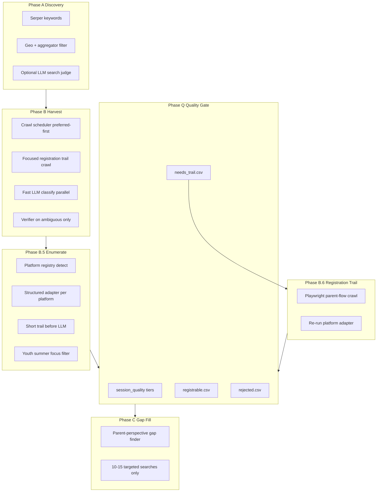
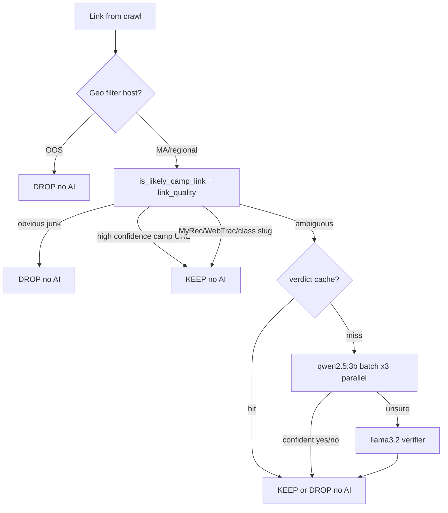
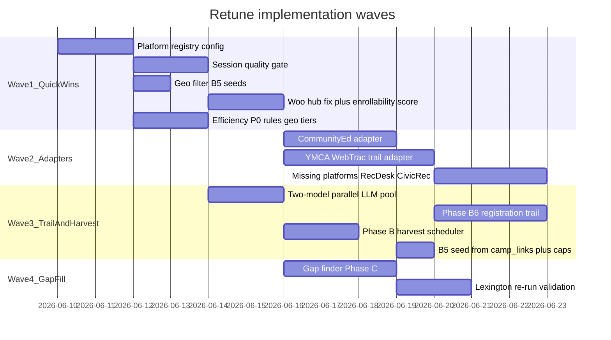

# Full Pipeline Retune Plan

## Pilot reality check (why this plan exists)

Lexington B.5 produced **200 sessions** but only **~75–85 are parent-ready** (WebTrac + MyRec + Hale). Main failures:

- **LexCE:** 40 kept rows are adult ed; **193 real Lexplorations rows dropped**; WooCommerce crawled entire `/shop/` (25 categories × 15 pages)
- **YMCA:** Marketing pages saved; **WebTrac weekly sessions never reached** (JS + no trail)
- **LLM fallback:** 69 rows (35%) with brochure/PDF register URLs (`cityoflex.com`, `/program/teens`, JCCA national list)
- **Geo slop:** 20 sessions from KY, NE, PA, VA, WI hosts still in B.5 seeds
- **0-session locals:** Summers Edge, MetroWest YMCA, Goddard, LCA, Camp Middlesex (blocked/portal)

Auto **Trust score 90/100** in [`deliverables.py`](src/deliverables.py) is wrong — it counts “has any URL” not “can enroll.”

---

## Target architecture (after retune)



---

## Part 1 — Platform registry (discover + implement)

### 1A. Inventory every platform (automated)

Extend [`scripts/fingerprint_providers.py`](scripts/fingerprint_providers.py) → **`scripts/fingerprint_all_candidates.py`**:

- Input: all hosts from [`data/candidates.csv`](data/candidates.csv) + unique hosts from [`data/camp_links.csv`](data/camp_links.csv)
- Output: `data/platform_fingerprint_report.csv` (host, page_signals, links_to, final_url, error)
- Run once per town pilot; reuse signatures below

### 1B. Master platform table (current vs target)

| Platform | Detection signals | B.5 today | Target adapter |
|----------|-------------------|-----------|----------------|
| **WebTrac / myvscloud** | `myvscloud.com`, `webtrac`, `wbwsc` | Structured [`adapter_webtrac`](src/platforms.py) — **works** (Hayden 40 sessions) | Enhance: scan **HTML body** for embedded URLs; YMCA subdomain discovery |
| **MyRec.com** | `myrec.com`, `program_details.aspx` | Structured [`adapter_myrec`](src/platforms.py) — **works** (LexRec 28) | Keep; ensure activities.aspx crawl |
| **WooCommerce** | `woocommerce`, `/class/`, `add-to-cart` | Broken for community ed — crawls `/shop/` | **New CommunityEd adapter** (see Part 2) |
| **Sawyer / HiSawyer** | `hisawyer.com` | Partial portal | Parse activity-set IDs; filter summer |
| **CampBrain** | `campbrainregistration.com` | Portal only | Trail + optional Firecrawl; Summers Edge |
| **Daxko** | `daxko`, `operations.daxko` | Portal only | **New YMCA/Daxko adapter** — follow ops links |
| **ACTIVE / ActiveCommunities** | `activecommunities.com`, `apm.activecommunities` | Portal | Catalog URL pattern adapter |
| **CommunityPass** | `communitypass.net` | Portal | Listing page pagination |
| **Ultracamp** | `ultracamp.com` | Portal | Session links from camp host pages |
| **ArbiterSports** | `arbitersports.com` | Portal | Program search links |
| **RecDesk** | `recdesk.com` | **Missing** | Add detection + listing adapter |
| **CivicRec / CivicPlus** | `civicrec`, `civicplus` | **Missing** | Add detection + `.gov` rec catalog adapter |
| **PerfectMind** | `perfectmind` | **Missing** | Portal + trail |
| **Jackrabbit** | `jackrabbitclass.com` | **Missing** | Class catalog adapter |
| **CampDoc** | `campdoc.com` | **Missing** | Portal link extraction |
| **CampMinder** | `campminder.com` | In [`registration.py`](src/registration.py) only | Portal adapter |
| **Squarespace / Wix / Weebly** | builder signatures | LLM fallback | **Trail first**, LLM last |
| **WordPress (non-Woo)** | `wp-content` without woo | CUSTOM/LLM | Trail first |
| **Custom marketing** | none | LLM (error-prone) | B.6 registration trail |

**Centralize** signatures in new [`config/platforms_registry.py`](config/platforms_registry.py) — single source for fingerprint script, `detect_platform()`, and [`registration.py`](src/registration.py).

---

## Part 2 — Community Ed / Lexplorations (all towns)

**Problem:** [`adapter_woocommerce`](src/platforms.py) falls back to `{host}/shop/` when seed path has no catalog prefix (e.g. seed `/class/lexplorations-2026` still triggers full shop crawl at lines 350–354). This breaks **every** `*communityed.org` / `*communityed.com` town (Newton, Westborough, Lexington, etc.).

**Fix — new `CommunityEdWooCommerce` path** (not generic WooCommerce):

Create [`config/community_ed.py`](config/community_ed.py):

```python
COMMUNITY_ED_HOST_SUFFIXES = ("communityed.org", "communityed.com")
CATALOG_PREFIXES = ("lexplorations", "childrens-programs", "children's-programs", "summer", "youth")
SUMMER_CATEGORY_PATTERNS = re.compile(r"summer|camp|vacation|lexplor", re.I)
ADULT_CATEGORY_DENY = ("cooking", "business", "esl", "exercise-dance", "humanities", ...)
```

New **`adapter_community_ed()`** in [`src/platforms.py`](src/platforms.py):

1. Resolve catalog prefix from seed URL ([`_catalog_path_prefix`](src/platforms.py) already exists — **enforce it**, never fetch `/shop/` root)
2. Only paginate categories matching `SUMMER_CATEGORY_PATTERNS` under that prefix (e.g. `/lexplorations/find-a-class`, `/class-category/summer-*`)
3. Only accept products at `/class/{slug}` **under prefix** with summer/camp signal in name OR category breadcrumb
4. Cap: **5 categories × 10 pages** (not 25 × 15)
5. Wire in `detect_platform()`: if host matches community ed suffix → `platform=community_ed` (not generic woocommerce)

**Seed selection** — tighten [`load_provider_urls()`](src/sessions.py):

- For `*communityed.*` hosts, **always** seed `/{lexplorations|childrens-programs}/find-a-class` or `/lexplorations/` (already partially in [`config/sources.py`](config/sources.py) `DIRECTORY_CRAWL_PREFERRED_PATHS`)

**Tests:** [`tests/test_community_ed_adapter.py`](tests/test_community_ed_adapter.py) — Lexington seed must not return “Social Security Planning”; must return `/class/` rows with summer in name.

---

## Part 3 — YMCA / JCC registration (highest user priority)

Most MA YMCAs use **WebTrac on a `{org}.myvscloud.com` subdomain** or **Daxko** behind a marketing site. B.5 failed because [`detect_platform()`](src/platforms.py) only checks **link hosts**, not HTML embeds, and uses LLM when detection fails.

**New `adapter_ymca()`** (dispatched when host matches `ymca.org`, `ymca.net`, `ymca*.org`):

1. **Deep fetch:** Playwright `wait_until=networkidle` (config flag) — extract all URLs from HTML + `href` + script src via regex `myvscloud|webtrac|daxko|operations\.daxko`
2. **WebTrac path:** Build catalog URL `{subdomain}/webtrac/web/search.html?module=AR&type=CAMP` → delegate to existing `adapter_webtrac`
3. **Daxko path:** Follow `operations.daxko.com` / program links → new minimal Daxko listing parser
4. **Parse search results page:** YMCA UI shows week rows (“Week 2: Sports Mania”) — extend WebTrac adapter to parse **search result HTML** when `iteminfo?FMID=` not in initial link list (new function in [`camp_validator.py`](src/camp_validator.py) `extract_webtrac_search_results()`)
5. **Geo block:** Skip `lexingtonymca.com` (KY), `ymcacky.org`, national `ymca.org` index in B.5 seeds ([`geo_filter.py`](src/geo_filter.py))

**JCC parallel:** Similar trail for `jcc*.org` hosts — many use Daxko or CampBrain; detect before LLM.

---

## Part 4 — Session quality gate (Phase Q)

New [`src/session_quality.py`](src/session_quality.py):

| Tier | Criteria | Output file |
|------|----------|-------------|
| **registrable** | `is_registration_platform_url(register_url)` OR WebTrac FMID / MyRec ProgramID | `*_sessions_registrable.csv` |
| **needs_trail** | Marketing page, portal, PDF, wrong host, LLM without platform URL | `*_needs_trail.csv` |
| **rejected** | Geo OOS, `/program/teens`, adult LexCE, JCCA national index, hub paths | `*_sessions_rejected.csv` |

Integrate into [`write_deliverables()`](src/deliverables.py):

- Replace misleading **Trust score** with **Enrollability score** (% registrable tier)
- Split `CAMPS_CATALOG.txt` into registrable vs needs review sections

**Hard reject patterns** (extend [`registration.py`](src/registration.py) `JUNK_PATH_RE`):

- `/program/teens`, `/program/children-classes`, `/government/`, `/discover/contact`, `.pdf`, `wp-content/uploads`

---

## Part 5 — Registration trail (Phase B.6)

New [`src/registration_trail.py`](src/registration_trail.py) + CLI `--phase trail` in [`run.py`](src/run.py):

- Input: `needs_trail.csv` rows + 0-session providers from B.5
- Reuse [`walk_site(focused=True)`](src/crawl.py) with [`crawl_link_score()`](src/registration.py) — already implements parent-flow priority
- Settings: 12 pages, depth 4, `stop_on_catalog=True`, `networkidle` for YMCA/JCC/city `.gov`
- On catalog found → re-dispatch platform adapter → merge into registrable tier
- Output: `*_trail_log.txt` per provider

**LLM rule change** in [`adapter_llm`](src/platforms.py): if trail finds nothing AND register URL would equal source page → mark `needs_trail`, **do not save as session**

---

## Part 6 — Phase B.5 enumerate retune

Changes to [`enumerate_provider()`](src/platforms.py):

1. **Trail-before-LLM:** 8-page focused crawl when `CUSTOM` and zero adapter results
2. **LLM output validation:** reject camps without platform register URL
3. **WooCommerce fix:** exclude `/program/{hub-slug}` products ([`_woo_product_re`](src/platforms.py) — require `camp|summer|clinic` in slug OR deny `teens`, `children-classes`, `faq`)
4. **B.5 seed sources** — extend [`load_provider_urls()`](src/sessions.py):
   - Apply [`geo_filter_crawl`](src/geo_filter.py) to seeds
   - Merge **one seed per host** from `camp_links.csv` (guide-discovered Code Wiz, Summers Edge, etc.) — not only `candidates.csv`
5. **Parallel fetch cap:** don't run 25-category LexCE crawl concurrently blocking all 52 providers (sequential heavy adapters or lower concurrency for WooCommerce hosts)

---

## Part 7 — Efficiency retune (full workflow: 10h → 1–2h target)

Lexington pilot timing (actual):

| Phase | Actual | Target (retuned) | Primary bottleneck |
|-------|--------|-------------------|-------------------|
| **Phase A** | ~1 min | ~1 min | Fine |
| **Phase B** | **~8–12 hr** | **45–90 min** | Crawl volume + sequential Ollama |
| **Phase B.5** | ~18 min (blocked 16 min on LexCE shop) | **15–30 min** | WooCommerce over-crawl + LLM fallback |
| **Phase Q + B.6 + C** | not run | **20–40 min** | Trail only on weak rows |
| **Total / town** | **~10–14 hr** | **~1.5–2.5 hr** | |

Design principle: **Rules and structured adapters first. AI last, small, and parallel.** Never let one provider (LexCE shop) block the whole run.

---

### 7A. The LLM funnel (reduce calls before any model runs)

Today Phase B calls Ollama **sequentially** for almost every ambiguous link ([`filter_rows_with_llm`](src/camp_validator.py) — one `asyncio.to_thread` per row, ~10–15 sec each). Lexington logged **2,370+ LLM decisions** across harvest runs.

**Target funnel** — each link passes through cheap layers; only survivors hit AI:



**Expand rules-first (no AI)** in [`camp_validator.py`](src/camp_validator.py), [`filter_links.py`](src/filter_links.py), [`link_quality.py`](src/link_quality.py):

- Auto-**KEEP** without LLM: `program_details.aspx`, `iteminfo?FMID=`, `/class/{slug}` on communityed, `myvscloud`, `hisawyer.com/.../activity-set`, URLs matching [`_HIGH_CONFIDENCE_RE`](src/camp_validator.py)
- Auto-**DROP** without LLM: `.pdf`, `.gov/documentcenter`, `/senior`, `/membership`, image URLs (`wp-content/uploads/*.jpg`), national indexes (already in geo_filter + link_quality)
- **Geo skip before crawl:** in [`_harvest_candidates`](src/run.py), if [`is_out_of_state_url`](src/geo_filter.py) on seed → mark `crawled=true`, skip HTTP entirely (saves hours on KY YMCA, Pittsburgh JCC seeds)

**Verdict cache** ([`cache/camp_verdicts.json`](cache/camp_verdicts.json)): persist across runs; warm cache makes re-runs near-instant for Phase B.

**Expected reduction:** ~690 links → **~150–250 need any LLM** (~65–75% fewer calls).

---

### 7B. Two-model classification (fast + verifier)

Replace single-model sequential loop with **tiered models**:

| Role | Model | When | Timeout | Settings key |
|------|-------|------|---------|--------------|
| **Fast classifier** | `qwen2.5:3b` | Every link that reaches LLM layer | ~2–4 sec | `ollama_fast_model` |
| **Verifier** | `llama3.2` (current) | Only when fast returns `unsure` or low confidence | ~10–15 sec | `ollama_verify_model` |

**New response schema** from fast model ([`config/prompts.py`](config/prompts.py)):

```json
{"is_camp": true|false, "confidence": "high"|"low", "reason": "..."}
```

**Decision logic** in new `classify_camp_page_tiered()`:

- `confidence=high` + `is_camp=true` → KEEP (no verifier)
- `confidence=high` + `is_camp=false` → DROP (no verifier)
- `confidence=low` OR fast/verify **disagree** → call verifier; if still unsure → **DROP** (safe default) + log to `data/review_queue.csv`
- Verifier and fast **agree** → accept

**Expected split (Lexington estimate):** ~70% resolved by fast only, ~20% need verifier, ~10% dropped without verifier.

---

### 7C. Parallel Ollama execution

Today: strictly sequential (`for row in rows: await asyncio.to_thread(classify...)`).

**New:** [`src/llm_pool.py`](src/llm_pool.py) — async batch executor:

```python
# Pseudocode
async def classify_batch(rows, *, concurrency=3):
    sem = asyncio.Semaphore(concurrency)
    async def one(row):
        async with sem:
            return await asyncio.to_thread(classify_camp_page_tiered, ...)
    return await asyncio.gather(*[one(r) for r in rows])
```

**Settings** ([`config/settings.py`](config/settings.py)):

```python
"ollama_fast_model": "qwen2.5:3b",
"ollama_verify_model": "llama3.2",
"ollama_classify_concurrency": 3,      # parallel fast calls
"ollama_verify_concurrency": 2,          # verifier smaller pool
"ollama_keep_alive": "30m",             # avoid model reload between batches
"ollama_preload_models": True,           # ollama pull + warmup both at run start
```

**Important:** Ollama on Mac handles ~2–4 parallel requests well; `concurrency=3` is the sweet spot before RAM thrashing.

**Math (Lexington):** 250 LLM links × 12 sec sequential = **50 min**; with 70% fast-only at 3 sec + 30% verify at 12 sec, parallel ×3 → **~8–12 min** for LLM portion.

---

### 7D. Crawl efficiency (biggest wall-clock saver)

Phase B spent **hours** on undifferentiated deep crawls. Tiered profiles in [`config/settings.py`](config/settings.py):

| Seed class | Detection | max_pages | delay | focused | stop_on_catalog | Example |
|------------|-----------|-----------|-------|---------|-----------------|---------|
| **preferred** | `preferred=true` or rec/communityed/myrec | 8 | 1.5s | yes | yes | LexRec, Hayden, LexCE |
| **camp_host** | [`is_camp_host_seed_url`](src/camp_hosts.py) | 12 | 2s | yes | yes | Summers Edge |
| **directory** | classified directory | 40 | 3s | no | no | Generic rec site |
| **unknown** | everything else | **10** | 1.5s | yes | yes | Middlesex CC — **cap hard** |

**CLI flags** ([`run.py`](src/run.py)):

- `--preferred-only` — skip `unknown` seeds entirely (Lexington: 81 → ~35 seeds, **biggest single save**)
- `--hosts jwhayden,lexrecma,lexingtoncommunityed` — partial re-run
- `--no-llm-validate` — rules-only harvest; defer AI to B.5/Q (optional fast path)

**Crawl scheduler** (new [`src/crawl_scheduler.py`](src/crawl_scheduler.py)):

1. Sort seeds: preferred → camp_host → directory → unknown
2. Geo-blocked seeds never queued
3. **`max_links_per_domain_per_harvest: 80`** already exists — enforce earlier in walk, not after 300 pages
4. **Skip image/media URLs** in crawler enqueue (YMCA `wp-content/uploads` problem — 2535 rule-pass links on ymcaofcm)

**Link-follow gate** ([`make_link_follow_gate`](src/camp_validator.py)): keep cap at 6 LLM calls/source; default **off for unknown** seeds (`ollama_link_follow: false` for unknown tier).

**Expected:** Crawl wall-clock **8–12 hr → 45–75 min** with `--preferred-only` + tiered caps.

---

### 7E. Phase A efficiency

| Change | Detail |
|--------|--------|
| Geo at ingest | Already partially done; extend to reject KY/NE/Pittsburgh **before** `candidates.csv` write |
| LLM judge | Only for `source_type=unknown` search hits (~10 per query max), not rule-classified |
| Dedupe | Skip crawl of hosts already in `camp_links.csv` with >N links |
| Phase C off by default | Already `phase_all_includes_c: false` — keep |

Phase A stays ~1 min / town.

---

### 7F. Phase B.5 efficiency

| Problem (Lexington) | Fix |
|---------------------|-----|
| LexCE 25×15 shop pagination ~16 min blocking gather | **CommunityEd adapter** — 5×10 cap; **heavy adapter semaphore** (max 1 WooCommerce crawl at a time) |
| 69 LLM session rows | **Structured adapter first**; trail-before-LLM; LLM only if trail fails |
| 353 focus drops then 45 LLM tie-breakers | Default `ollama_focus_verify: false` for harvest-scale; rules-only focus; LLM tie-break only in Q/trail |
| 52 providers parallel | Keep `concurrency=3` but **isolate slow adapters** — don't starve fast MyRec/WebTrac jobs |
| Wrong-state seeds crawled | Geo-filter seeds in [`load_provider_urls`](src/sessions.py) |

**B.5 target:** 15–30 min / town (Lexington).

---

### 7G. Phase Q + B.6 + C efficiency

- **Q gate:** pure Python, no AI — instant on existing CSV
- **B.6 trail:** only `needs_trail` rows (~30–50 URLs), not all 690 links — 12 pages max each, focused mode
- **Phase C gap-fill:** 10–15 searches max, not 281 keywords — one Ollama gap analysis call (~30 sec)

---

### 7H. Optional harvest modes (operator choice)

| Mode | Phase B | LLM | Use when |
|------|---------|-----|----------|
| **`--phase all` (default retuned)** | preferred seeds, tiered crawl, two-model parallel | Yes, funnel | Production quality |
| **`--preferred-only --no-llm-validate`** | Rules only | No | Fast wide harvest (~30 min) |
| **`--phase b5` on existing links** | Skip B | B.5 only | Re-enumerate after adapter fixes |
| **`--phase trail`** | Skip | No | Fix weak register URLs only |
| **`--phase gap --max-searches 15`** | Skip | 1 gap call | Fill holes after Q |

**Recommended Lexington re-run after retune:** `--preferred-only` full pipeline first (~1.5–2 hr), then `--phase gap` if needed.

---

### 7I. Metrics and observability

Extend [`harvest_activity_*.csv`](data/harvest_activity_2026-06-09_2158.csv) and run summary:

- `llm_fast_calls`, `llm_verify_calls`, `llm_skipped_rules`, `llm_cache_hits`
- `crawl_pages_by_tier`, `crawl_seconds_by_source`
- Per-phase wall-clock in [`pilot_analysis.md`](data/lexington_pilot_analysis.md) auto-update

**Run-start warmup** in [`run.py`](src/run.py):

```bash
ollama pull qwen2.5:3b && ollama pull llama3.2
# POST warmup requests to load both models into RAM
```

---

### 7J. Efficiency implementation checklist (files)

| Priority | Task | File(s) | Est. time save |
|----------|------|---------|----------------|
| **P0** | `--preferred-only` + geo skip before crawl | [`run.py`](src/run.py), [`geo_filter.py`](src/geo_filter.py) | **4–6 hr** |
| **P0** | Tiered crawl profiles (unknown cap 10) | [`settings.py`](config/settings.py), [`run.py`](src/run.py) | **2–4 hr** |
| **P0** | Expand rules KEEP/DROP before LLM | [`camp_validator.py`](src/camp_validator.py), [`filter_links.py`](src/filter_links.py) | **1–2 hr** LLM |
| **P0** | CommunityEd adapter caps (B.5 unblock) | [`platforms.py`](src/platforms.py) | **15 min** B.5 + accuracy |
| **P1** | Two-model tiered classify | [`camp_validator.py`](src/camp_validator.py), [`prompts.py`](config/prompts.py) | **30–40 min** LLM |
| **P1** | Parallel batch executor | [`llm_pool.py`](src/llm_pool.py) (new) | **3× on LLM portion** |
| **P1** | Crawl scheduler sort + image URL skip | [`crawl_scheduler.py`](src/crawl_scheduler.py), [`crawl.py`](src/crawl.py) | **30–60 min** crawl |
| **P2** | `--no-llm-validate` harvest mode | [`run.py`](src/run.py) | Optional **~50 min** |
| **P2** | Disable B.5 focus LLM tie-breaker default | [`settings.py`](config/settings.py) | **5–10 min** B.5 |
| **P2** | LLM metrics in harvest_activity | [`harvest_log.py`](src/harvest_log.py) | Observability |

---

### 7K. Projected Lexington timeline (after all P0+P1)

| Step | Duration |
|------|----------|
| Phase A | 1 min |
| Phase B (preferred, tiered, parallel two-model) | **50–70 min** |
| Phase B.5 (structured-first, CommunityEd capped) | **20–30 min** |
| Phase Q (quality split) | <1 min |
| Phase B.6 trail (~40 weak URLs) | **15–25 min** |
| Phase C gap (optional, 15 searches) | **5–10 min** |
| **Total** | **~1.5–2.5 hours** |

---

## Part 8 — Agentic gap-fill Phase C

Replace blind 281-keyword sweep with [`src/gap_finder.py`](src/gap_finder.py):

1. Input: **registrable** sessions + category taxonomy (~30 parent categories: sports, STEM, arts, special needs, overnight, etc.)
2. Rule pass: category count == 0 → template search from [`config/gap_taxonomy.py`](config/gap_taxonomy.py)
3. One Ollama pass: “Lexington parent — what’s missing?” → 5–15 queries max
4. Run searches → dedupe → harvest new hosts → B.5 on new hosts only
5. CLI: `--phase gap --town Lexington --max-searches 15`

Phase C disabled in `--phase all` stays default; explicit `--phase gap` after Q gate.

---

## Part 9 — Optional Firecrawl pass (Phase F)

For rows still in `needs_trail` after B.6 (Summers Edge CampBrain, blocked JCCs):

- Export URL list → Firecrawl scrape → feed HTML/links back into platform adapters
- Keep **out of v1 critical path**; implement after B.6 proves trail gap list

---

## Part 10 — Testing and validation

| Test file | Covers |
|-----------|--------|
| `tests/test_community_ed_adapter.py` | LexCE scope, no shop crawl, summer classes kept |
| `tests/test_session_quality.py` | teens hub, cityoflex, geo KY, good MyRec |
| `tests/test_ymca_webtrac.py` | myvscloud discovery from marketing HTML fixture |
| `tests/test_platform_detect.py` | registry signatures |
| `tests/test_woo_product_re.py` | bostonjcc `/program/teens` rejected |

**Lexington acceptance criteria (re-run after retune):**

- Lexplorations: **50+ summer `/class/` sessions** with real product URLs (not 40 adult classes)
- LexRec + Hayden: unchanged or better (~68 platform sessions)
- YMCA (WSYMCA / ymcaboston / MetroWest): **WebTrac week rows OR honest needs_trail**, not brochure portals
- SOAR: registrable URL or explicit needs_trail (not SPED events index)
- **Registrable tier ≥ 120 sessions**, rejected tier catches JCCA + KY + teens hub
- Summers Edge: registrable OR flagged needs_trail with CampBrain URL
- Empow: found via gap-fill OR documented miss
- 0 wrong-state hosts in registrable CSV
- **Phase B wall-clock ≤ 90 min** with `--preferred-only` (vs ~10 hr pilot)
- **LLM calls ≤ 300/town** (vs ~2,370 pilot); **≥60% resolved by rules/cache** without any model
- **Total pipeline ≤ 2.5 hr/town** (A + B + B.5 + Q + optional trail)

---

## Implementation order (recommended)



**Wave 1** can run on **existing** `lexington_camp_sessions.csv` immediately (quality split, no re-scrape). **Efficiency P0** (rules-first, geo skip, tiered caps, `--preferred-only`) can ship in Wave 1 without waiting on adapters.

**Wave 2–3** require code + Lexington re-run (**~1.5–2.5 hr** optimized vs **10+ hr** current).

**Wave 4** after catalog is trustworthy.

---

## Key files to create/modify

| Action | Path |
|--------|------|
| **Create** | `config/platforms_registry.py`, `config/community_ed.py`, `config/gap_taxonomy.py` |
| **Create** | `src/session_quality.py`, `src/registration_trail.py`, `src/gap_finder.py`, **`src/llm_pool.py`**, **`src/crawl_scheduler.py`** |
| **Create** | `scripts/fingerprint_all_candidates.py` |
| **Modify** | [`src/platforms.py`](src/platforms.py) — CommunityEd, YMCA, detect, Woo fix |
| **Modify** | [`src/sessions.py`](src/sessions.py) — seeds, geo, camp_links hosts |
| **Modify** | [`src/deliverables.py`](src/deliverables.py) — tiers, enrollability score |
| **Modify** | [`src/run.py`](src/run.py) — `--phase trail`, `--phase gap`, `--preferred-only` |
| **Modify** | [`src/relevance.py`](src/relevance.py) — hub drops, lesson vs clinic |
| **Modify** | [`config/settings.py`](config/settings.py) — crawl tiers, `ollama_fast_model` / `ollama_verify_model`, concurrency, B.6 caps |
| **Modify** | [`src/camp_validator.py`](src/camp_validator.py) — rules expansion, `classify_camp_page_tiered()`, parallel batch |
| **Modify** | [`config/prompts.py`](config/prompts.py) — fast model confidence schema |
| **Modify** | [`src/harvest_log.py`](src/harvest_log.py) — LLM funnel metrics |

---

## What this chat incorporated (checklist)

- B.5 purpose vs Phase B — session catalog not link dump
- Agentic **gap-fill Phase C** (not full agent replacement)
- **Registration trail** / parent signup flow (cityoflex, YMCA WebTrac)
- **Multi-agent** pattern: fast classifier + verifier (Phase B), not orchestrator for whole run
- **False positives:** teens hub, tennis lessons scope, JCCA national, LexCE adult ed, geo slop
- **False negatives:** Lexplorations dropped, Summers Edge 0, MetroWest YMCA 0, SOAR bad URL, Empow missing
- **Speed (full workflow):** rules-first LLM funnel, two-model fast+verifier, parallel Ollama (×3), `--preferred-only`, tiered crawl caps, geo skip before crawl, CommunityEd caps, heavy-adapter semaphore, `--no-llm-validate` optional mode, B.5 structured-first, Phase C 15-search cap — **10h → 1.5–2.5h target**
- **Trust score fix** — enrollability not URL completeness
- **Firecrawl** as Phase F for JS-blocked remainder
